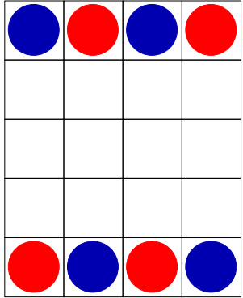

Red Vs Blue
===========

Two players are playing against each other in a turn based game. 
Each player can make only one move in its own turn. There is a blue and a red player.
Both players have 4 pucks in a 5X4 table.

This is the starting position:  
  
Red player starts the game. The goal is to move at least 3 pucks in the same ***row***, ***column*** or ***diagonal***.
That player wins who can do it first.
